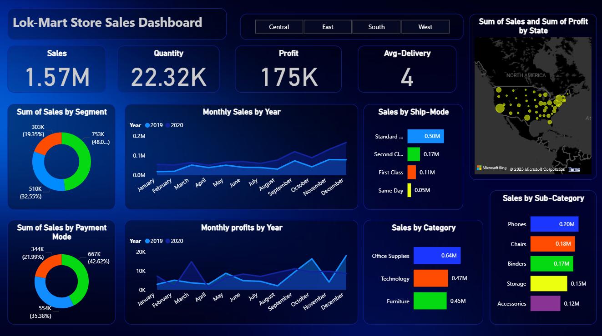

# 📊 Lok-Mart Sales Dashboard

A Power BI dashboard to visualize and analyze sales performance, profit, delivery metrics, and more for Lok-Mart Store.

## 🔍 Features
- Sales Overview: Total Sales, Quantity, Profit, Avg. Delivery
- Drilldowns by:
  - Segment
  - Payment Mode
  - Ship Mode
  - Product Category & Sub-category
  - Geographic Region (Map view)
- Monthly Trends for Sales and Profit

## 🛠️ Tech Used
- Power BI
- Microsoft Excel (for data source)
- DAX (for calculated columns and measures)

## 📸 Screenshot

## 🌐 Portfolio
Check out more projects at: [https://rabishankar21.github.io](https://rabishankar21.github.io)
